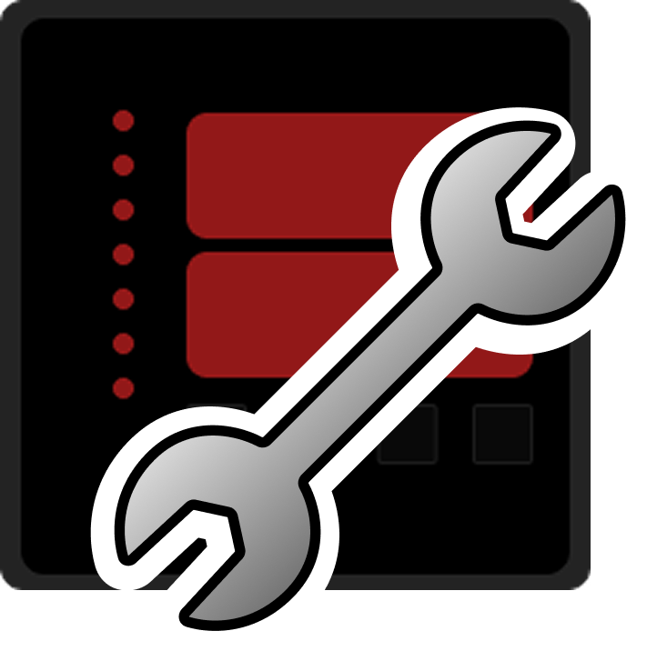
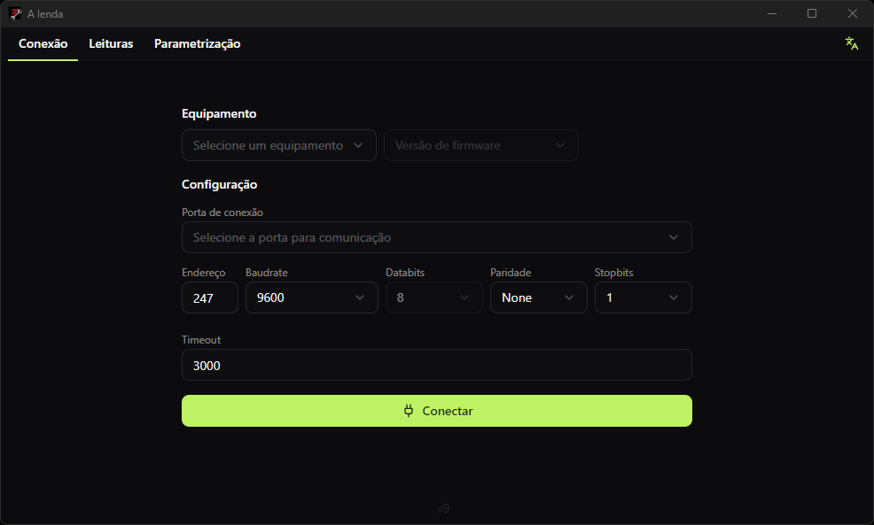
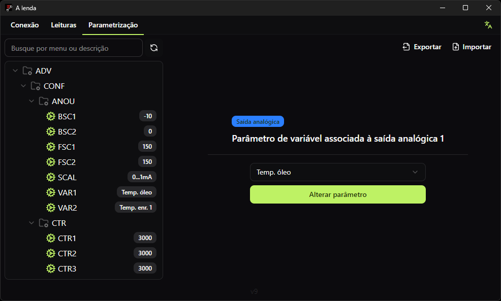

<h1 align="center"> A Lenda</h1>

<p align="center">⚡ Aplicativo <strong>Electron</strong> para conexão Modbus RTU com equipamentos Treetech, oferecendo leitura e parametrização com UI moderna, buscas poderosas e compatibilidade automática com novos modelos e versões.
  <br/><br/>
  <!-- Releases -->
  <a href="https://github.com/hugo-wemer/a-lenda/releases">
     
  </a>
</p>

<p align="center">
  <a href="#a-lenda">
    
  </a>
</p>

#  A Lenda

**A Lenda** conecta-se via **Modbus RTU** aos equipamentos para **visualizar leituras e gerenciar parâmetros**.  
Com ele, você pode **buscar por parâmetros/leituras**, **salvar backups**, **clonar** uma configuração de um equipamento para outro e **exportar todos os registradores em CSV**.  
Além disso, a **compatibilidade com novos equipamentos e versões é disponibilizada automaticamente**, sem necessidade de atualizar o software.

> Projeto em desenvolvimento ativo. Veja **Releases** para binários experimentais e changelog.

<p align="center">
  <a href="#a-lenda">
    
  </a>
</p>


#  Features

- **Comunicação**
  - 🔌 **Modbus RTU** (porta serial) para leitura/parametrização
  - ⏱️ Leituras rápidas feita por **blocos**
  - 🧪 Feedback de erros (exceções Modbus) na UI ao escrever

- **Operação & UX**
  - 👀 **Visualização amigável** de leituras e parâmetros
  - 🔎 **Busca** por parâmetros e por leituras (nome, grupo, registrador…)
  - ✍️ **Alteração de parâmetros** com validação (Zod + React Hook Form)
  - 🧬 **Backup/restore** de parâmetros e **“colar”** em outro equipamento através do `.settings`
  - 📤 **Exportar `.csv`** com **todos os registradores**
  - ♻️ **Compatibilidade automática** com novos equipamentos/versões **sem atualizar o app**

- **Stack & produtividade**
  - ⚛️ React 19 + Electron + Vite
  - 💙 TypeScript 5
  - 🌬️ Tailwind v4 + shadcn/ui + lucide-react
  - 🧠 Zustand + Immer para estado previsível e performático
  - 🧰 Preload (contextBridge) e IPC seguros
  - 🧹 Biome (lint/format)
  - 📦 Electron Builder (instaladores por plataforma)

<br/>


#  Requisitos
- [Node.js >= 20](https://nodejs.org/en/download/)
- [pnpm >= 10](https://pnpm.io/installation)


#  Instalação e Desenvolvimento

```bash
# 1) Clonar o repositório
git clone https://github.com/hugo-wemer/a-lenda.git
cd a-lenda

# 3) Instalar dependências
pnpm install

# 4) Rodar em desenvolvimento
pnpm run dev
